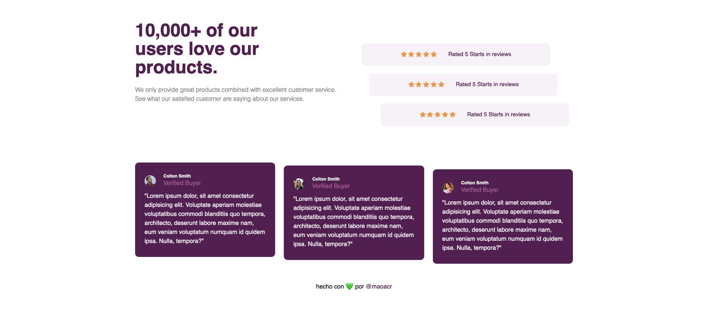
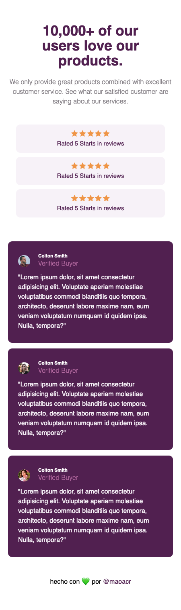

# My Social section proof solution - Frontend Mentor

This is my solution to the [Social proof section challenge on Frontend Mentor](https://www.frontendmentor.io/challenges/social-proof-section-6e0qTv_bA). Frontend Mentor challenges help you improve your coding skills by building realistic projects. 

## Table of contents

- [Overview](#overview)
  - [The challenge](#the-challenge)
  - [Screenshot](#screenshot)
  - [Links](#links)
- [My process](#my-process)
  - [Built with](#built-with)
  - [Continued development](#continued-development)
- [Author](#author)

## Overview

### The challenge

Users should be able to:

- View the optimal layout for the section depending on their device's screen size

### Screenshots

### Links

- [Solution URL](https://github.com/maoacr/social-sections)
- [Live Site URL](https://maoacr.github.io/social-sections/)

## My process

### Built with

- Semantic HTML5 markup
- CSS custom properties
- Flexbox
- CSS Grid
- Mobile-first workflow

### Continued development

Definitely, Writing Responsive Designs and Layouts in HTML and CSS can be as easy or as difficult as you want, which is why I feel like we should never stop doing these types of exercises.

## Author

- Website - [Mao](https://maoacr.com)
- Frontend Mentor - [@maoacr](https://www.frontendmentor.io/profile/maoacr)
- Twitter - [@maoacr](https://www.twitter.com/maoacr)